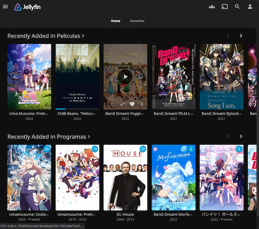
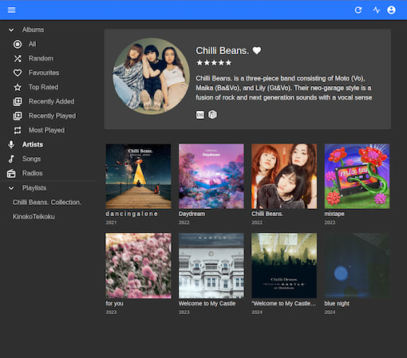

Photo by <a href="https://unsplash.com/@rohanphoto?utm_source=unsplash&utm_medium=referral&utm_content=creditCopyText">Rohan</a> on <a href="https://unsplash.com/photos/a-laptop-and-a-computer-ZoXCoH7tja0?utm_source=unsplash&utm_medium=referral&utm_content=creditCopyText">Unsplash</a>
      
Hi, this is a little project I've been working on for a while and I wanted to share it here.
## The idea
The idea is to have a home server that can store all my movies, series and music, and be able to access them from any device in my home network, and even outside of it.
## The hardware
For this project I used:
- An old Sony Vaio laptop that has a broken screen, it comes with a duo core AMD CPU and 8GB of RAM, which is more than enough for my needs.
- A 128GB SSD for the operating system and a 500GB HDD for storage connected via USB. Not very fancy, but it works.
## The software
-  **[Ubuntu Server 24.04 LTS](https://ubuntu.com/download/server)** as the operating system which is a lightweight distro since my laptop is not very powerful.
-  **Docker** to manage the different services I wanted to run on my server.

The main services running as Docker containers are:
- **Jellyfin**: for media streaming (movies and series).
- **Navidrome**: for music streaming.

I manage the server via SSH from my personal laptop.

## The setup
1. Install Ubuntu Server 24.04 LTS on the laptop.
2. Install [Docker](https://docs.docker.com/engine/install/ubuntu/#install-using-the-repository).
3. In my case I have my media files stored on an external HDD, so I mounted it to `/media` on the server. I have two folders inside `/media`: `Movies` and `Shows`.
For music, I use some space on the SSD, so I created a folder `/data/music` for that.
4. I also created a folder `/data/config` and `/data/cache` to store the configuration files for Jellyfin.
5. Configure UFW to allow access to the necessary ports:

I set up UFW  to allow only the necessary ports for my services:
- 8096 for Jellyfin
- 4533 for Navidrome
- 22 for SSH

I allow access to these ports only from my home network and block everything else.
I do something like:
```bash
sudo ufw allow from [YOUR-LOCAL-SERVER-IP]/24 to any port 8096 proto tcp
```
For more information on how to set up UFW, you can check the [official documentation](https://help.ubuntu.com/community/UFW).

6. Create Docker Compose files for Jellyfin and Navidrome with the necessary configurations.

You need to read the documentation of each service to customize the configurations to your needs.
- Jellyfin documentation: https://jellyfin.org/docs/general/installation/container
- Navidrome documentation: https://www.navidrome.org/docs/installation/docker/


This are examples of the `docker-compose.yml` files I used:
You probably won't need `JELLYFIN_PublishedServerUrl` if you are not accessing it from outside your home network.
```yaml
# Jellyfin docker-compose.yml
services:
  jellyfin:
    image: jellyfin/jellyfin
    container_name: jellyfin
    user: "1000:1000"
    volumes:
      - /data/config:/config
      - /data/cache:/cache
      - /media:/media
    restart: 'unless-stopped'
    network_mode: host
    environment:
      - JELLYFIN_PublishedServerUrl=https://your-domain.com
```
Again, here you probably won't not need to set `ND_BASEURL` if you are not accessing it from outside your home network.
For Last.fm and Spotify integration, you need to create accounts and get your API keys. If you don't want to use these features, you can omit those environment variables.
- https://www.last.fm/api/account/create
- https://developer.spotify.com/documentation/web-api

```yaml
# Navidrome docker-compose.yml
services:
  navidrome:
    image: deluan/navidrome:latest
    user: 1000:1000 # should be owner of volumes
    ports:
      - "4533:4533"
    restart: unless-stopped
    environment:
      # Optional: put your config options customization here. Examples:
      ND_SCANSCHEDULE: 1h
      ND_LOGLEVEL: info
      ND_BASEURL: https://your-domain.com 
      ND_LASTFM_ENABLED: true
      ND_LASTFM_APIKEY: YOUR-LASTFM-API-KEY
      ND_LASTFM_SECRET: YOUR-LASTFM-SECRET
      ND_SPOTIFY_ID: YOUR-SPOTIFY-ID
      ND_SPOTIFY_SECRET: YOUR-SPOTIFY-SECRET
    volumes:
      - /data:/data
      - /data/music:/music
```

7. Start the Docker containers and configure the services via their web interfaces.
  - `http://[YOUR-SERVER-LOCAL-IP]:8096` for Jellyfin
  - `http://[YOUR-SERVER-LOCAL-IP]:4533` for Navidrome
8. Add media files to the respective directories and let the services index them.
For Jellyfin, I added the `Movies` and `Shows` folders as libraries.
Read the Jellyfin documentation for more details on how to structure your media files.
- https://jellyfin.org/docs/general/server/media/movies
- https://jellyfin.org/docs/general/server/media/shows

For Navidrome, you can scan your music folder to index your music files in the web interface.
## Accessing the server
- From my home network, I can access Jellyfin and Navidrome via their local IP addresses.

- From outside my home network, I can access them via Tailscale and a VPS acting as a relay.
I will explain this setup in more detail in another post.

## Conclusion
I think this is a fun project that allows me to recycle old hardware and reuse it for something cool like this home server and I also learn a lot about Linux, Docker and server management.
Of course I'm still learning and improving my setup, so if you have any suggestions or tips, feel free to share them with me!



