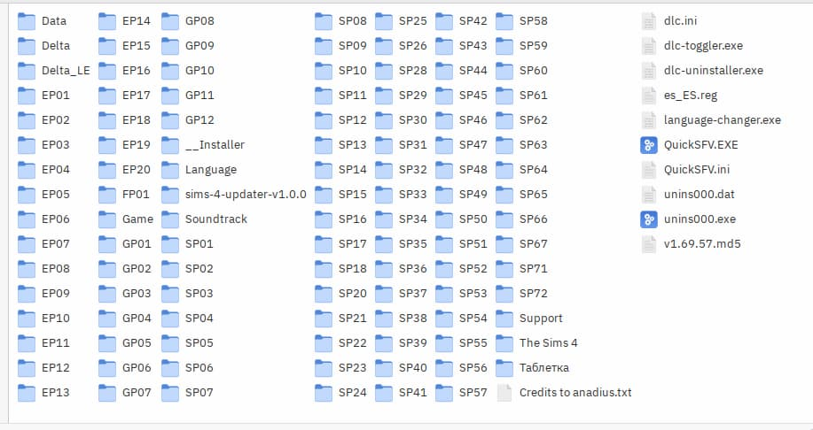
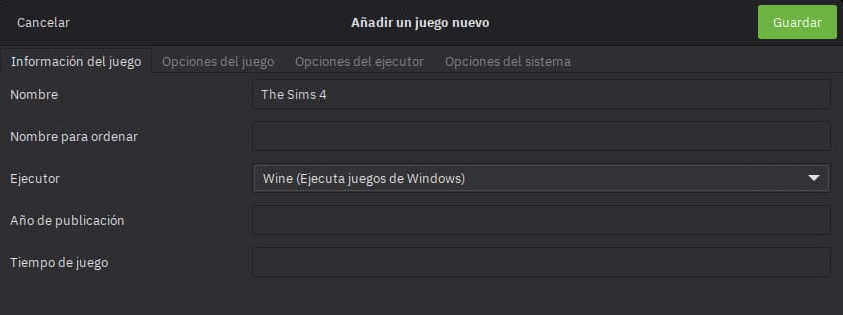
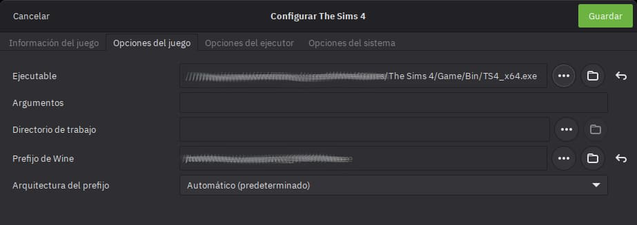
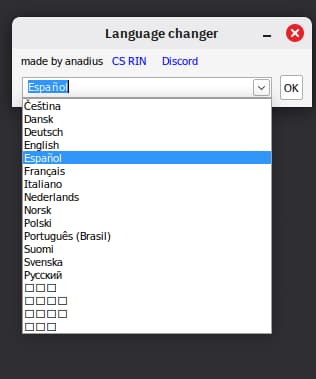
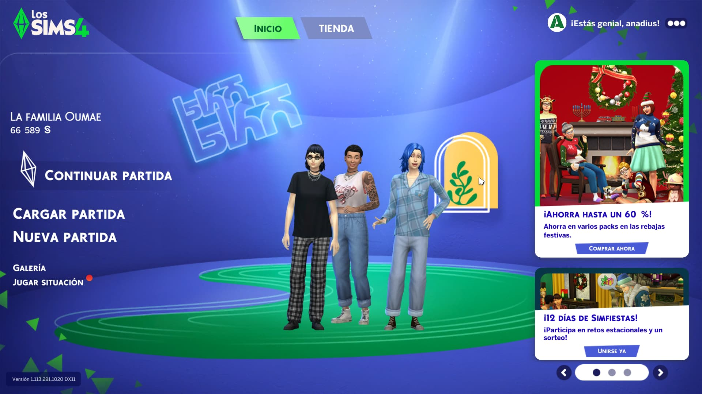

Hi everyone!

Today I want to share my experience getting The Sims 4 to run on Linux Mint 22. 

A little bit of context if you're interested, if not you can skip it and go directly to the requirements section.

>I recently migrated from Windows 11 to Linux Mint 22 in order to run away from Microsoft's privacy-invasive practices.
I managed to install all my favorite apps on Linux but the thing I was hesitant about was gaming, although I don't game that much, I do enjoy playing The Sims 4 and Grand Theft Auto from time to time.
The version of The Sims 4 I have is the Anadius repack version, I am aware that Anadius recently left, but I still have some of their repacks and they have worked fine in Windows, I have 
until version 1.113.291.1020 DX11. I think this version is from March of this year and covers up to the "Businesses & Hobbies" expansion pack. Haha I haven't played The Sims 4 in a while but I wanted to play it again on Linux.

After some research, I found out that The Sims 4 can be run on Linux using Wine and Lutris.

Ok let's see what we need to get started, you will need two things:

## Requirements:

- **Your folder where The Sims 4 is located (the anadius repack version)**. It should look something like this:

- **Install Wine and Lutris**: 

    - Since I am on Linux Mint, I followed the steps from this [guide](https://wine.htmlvalidator.com/install-wine-on-linux-mint-22.html).
So you need to check out a guide or tutorial on how to install Wine on your Linux distribution.

    - For Lutris, you can follow the instructions on their [official website](https://lutris.net/downloads/). 
I just installed the .deb package in my case.

Now that you have Wine and Lutris installed, we are ready to configure The Sims 4 in Lutris.

## Steps to configure The Sims 4 on Lutris:

1. Open Lutris and click on the "+" icon to add a new game.
2. Select "Add a locally installed game" from the option list.
3. In the "Add a new game" window, fill in the following details in the "Game info" tab:
   - Name: The Sims 4
   - Runner: Wine

4. Now go to the "Game options" tab and fill in the following:
   - Executable: Click on "Browse" and navigate to the folder where you have The Sims 4 located, then select the "TS4_64.exe" file inside the "Game" folder.
   - Wine prefix: You can leave this as default but I recommend creating a new prefix. For example, you can set it to "/home/yourusername/Games/sims4". We will need to create this folder beforehand. Remember this path as we will use it later.

5. Optional. Go to the "System options" tab:
   - Select your Graphics card in the "GPU" dropdown menu if you have one.

6. Now click on the "Save" button to save your game configuration.

7. If you had The Sims 4 installed on Windows and have a backup of your saves, you can copy them to the new Wine prefix folder you created earlier. The save files are usually located in "Documents/Electronic Arts/" inside the Wine prefix folder like "/home/yourusername/Games/sims4".

You can try to run The Sims 4 from Lutris by selecting it and clicking on the "Play" button.

But if your game is on a different language than english, you will need to do some extra steps to change the language to your desired one.

8. To change the language, in Lutris select The Sims 4 and click on the wine glass menu option (next to the "Play" button) and select "Run exe inside Wine prefix" then navigate to the folder where you have The Sims 4 and select language-changer.exe, this will open a window where you can select your desired language, in my case I selected Spanish.

9. Now you can run The Sims 4 by clicking on the "Play" button.

And that's it! You should now be able to play The Sims 4 on Linux Mint 22 (and I hope in any other Linux distro) using Wine and Lutris.

This is a screenshot of The Sims 4 running on my laptop with Linux Mint:

I wasn't able to do this without the help of this tutorial on [YouTube](https://www.youtube.com/watch?v=wKGUT8BFHCo)
and this reddit post [here](https://www.reddit.com/r/SteamDeckPirates/comments/1hp12ne/comment/m4g427f/?force-legacy-sct=1) regarding the language changer.

I am really grateful to them for sharing their knowledge! and now I am sharing it with you all.
